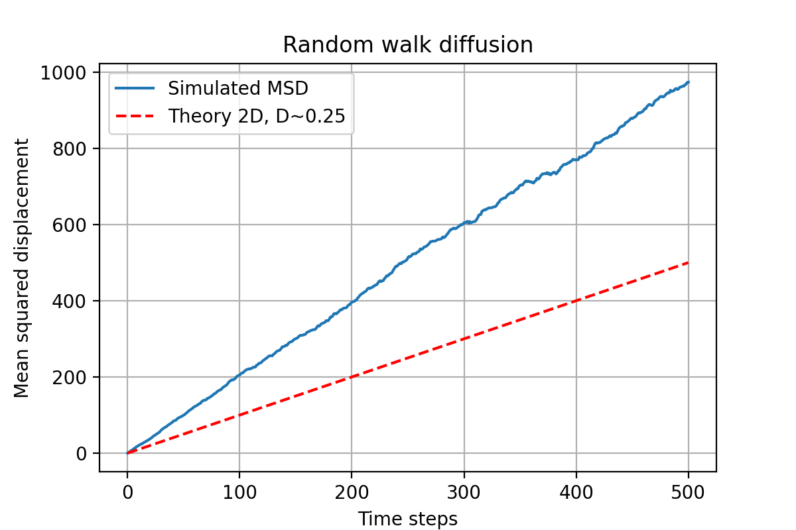
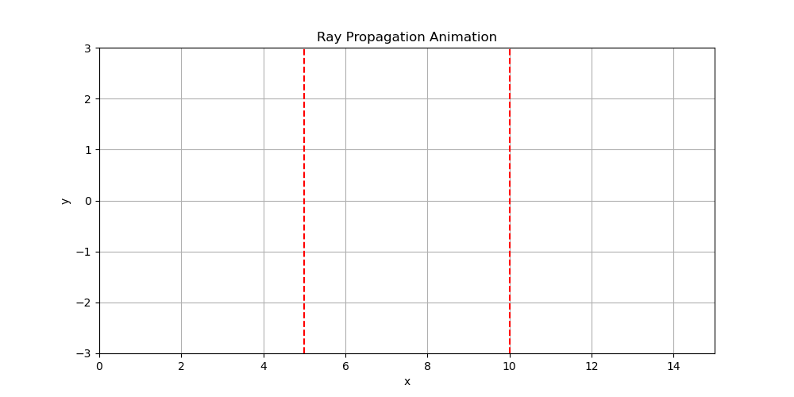
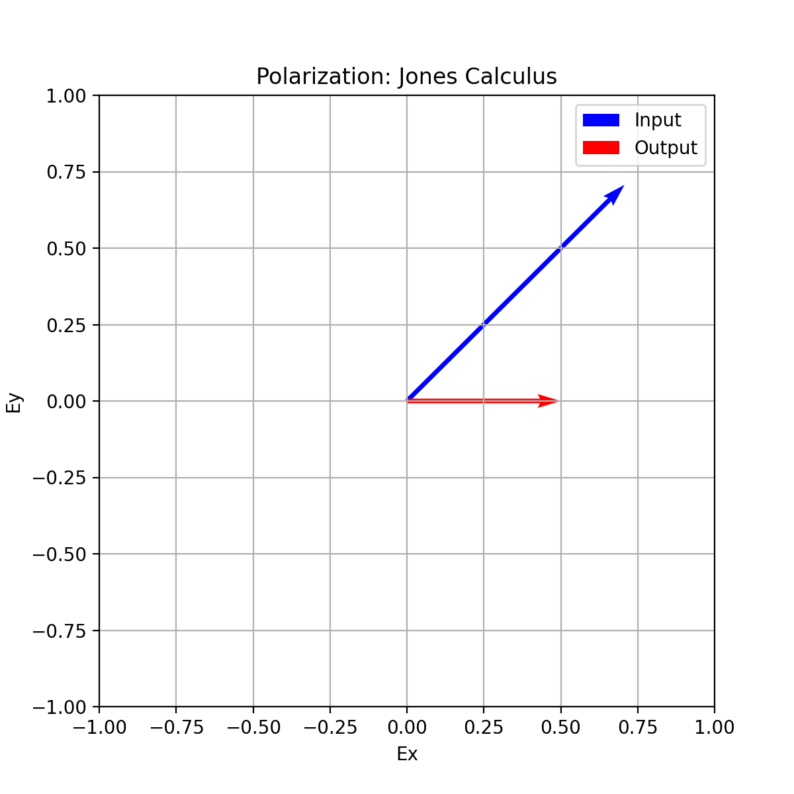

This Python script suite integrates three distinct physical simulations—random walk diffusion, polarization state evolution via Jones calculus, and 2D ray tracing through thin lenses—each accompanied by visualizations and animations to enhance conceptual understanding.
# 1. 🌀 Random Walk Diffusion Simulation
#  • 	Objective: Simulate and visualize the stochastic motion of particles undergoing a 2D random walk.
# • 	Methodology:
• 	Initializes 500 particles at the origin in 2D space.
• 	Each particle performs a symmetric random walk over 500 time steps.
• 	Tracks particle positions over time and computes the Mean Squared Displacement (MSD).
• 	Compares simulated MSD with theoretical predictions using the diffusion relation:
• 	Visualization:
• 	Static plot of MSD vs. time with theoretical overlay.
• 	Animated GIF showing particle dispersion over time in 2D space.
# 2. 🔬 Polarization State Tracking via Jones Calculus
# • 	Objective: Model the transformation of light polarization through optical components.
#  • 	Methodology:
• 	Constructs Jones vectors for linear polarization and matrices for a quarter-wave plate (QWP), half-wave plate (HWP), and polarizer.
• 	Applies sequential transformations to an input light beam polarized at 45°.
• 	Computes the output polarization state after passing through QWP → HWP → Polarizer.
• 	Visualization:
• 	Vector plot comparing input and output electric field components in the polarization plane.
# 3. 🔭 2D Ray Tracing Through Thin Lenses
• 	Objective: Simulate light ray propagation through a system of thin lenses.
• 	Methodology:
• 	Defines two lenses with specified positions and focal lengths.
• 	Initializes multiple rays at varying vertical positions.
• 	Applies paraxial ray tracing principles to compute ray deflections at lens interfaces.
• 	Visualization:
• 	Static plot showing ray trajectories and lens positions.
• 	Animated GIF illustrating dynamic ray propagation across the optical system.
🗂 Output Summary
• 	All plots and animations are saved in organized directories:
• 	: MSD plot and random walk animation.
• 	: Polarization vector plot.
• 	: Ray tracing plot and propagation animation.

This codebase serves as an educational toolkit for visualizing key physical phenomena in statistical mechanics and optics, combining numerical simulation with intuitive graphical outputs. Let me know if you'd like this abstract formatted for a report or presentation slide.

